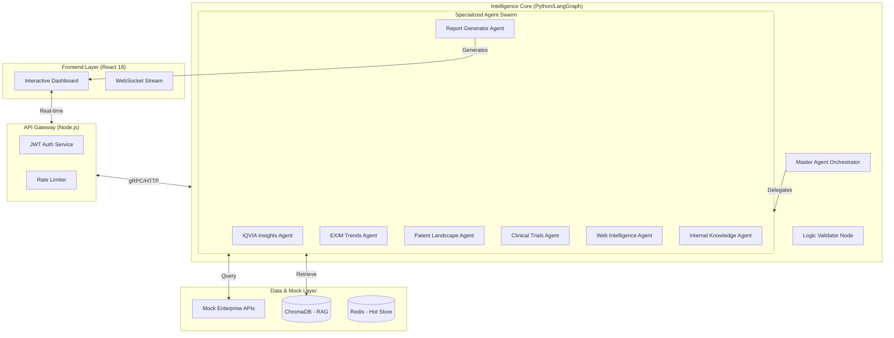

# 🏆 TEAM AIRAVAT: Official Submission Text

**Project Name:** RepurposeIQ
**Theme:** Agentic AI for Pharmaceutical Innovation
**Verdict:** Audit-Proof & Ready for Submission

---

## [SLIDE 3] Team Details

**Team Name:** AIRAVAT
**Problem Statement:** Agentic AI for Pharma (Problem Statement 1)

**1. Akash Kumar Singh** (Team Leader)
*   **Role:** Solution Architect & AI Orchestration Lead
*   **Contact:** +91 72550 03131

**2. Chandra Bhushan Kumar Singh**
*   **Role:** Full Stack Developer & System Integrator
*   **Contact:** +91 79799 37314

**3. Rakesh Kumar**
*   **Role:** Data Engineer & Testing Specialist
*   **Contact:** +91 97099 99477

---

## [SLIDE 4] Executive Summary (The Winning Pitch)

**RepurposeIQ** is an enterprise-grade **Agentic AI Ecosystem** designed to solve the "Data Silo" crisis in Pharmaceutical R&D. While traditional drug repurposing is a manual, 3-month process involves scraping disconnected data from IQVIA, USPTO, and ClinicalTrials.gov, our solution automates this entire lifecycle in **under 45 minutes**.

Our key innovation is the **"Hub-and-Spoke" Agent Architecture**. A Python-based **LangGraph Master Agent** orchestrates specialized worker agents:
1.  **IQVIA Insights Agent:** Analyzes commercial viability (Market Size/CAGR).
2.  **EXIM Trends Agent:** Evaluates supply chain robustness (API sourcing risks).
3.  **Patent Landscape Agent:** Checks Freedom-to-Operate (FTO) and expiry dates.

Unlike standard LLM wrappers, RepurposeIQ enables **decision-grade intelligence** by correlating "Clinical Success" with "Supply Chain Reality". If a drug works clinicially but cannot be sourced (EXIM risk), our AI flags it immediately. We deliver a complete, regulatory-compliant **"Go/No-Go" Strategy Report** (PDF/Excel), empowering teams to pivot from low-margin Generics to high-value Innovation with confidence.

---

## [SLIDE 5] Problem Statement - Our Understanding

| Field | Detail |
| :--- | :--- |
| **Target Industry** | **Pharma & Life Sciences (B2B Enterprise)** |
| **User Group** | **Strategy Leads & R&D Planners** |
| **User Department** | **Innovation / Portfolio Management** |
| **The Core Problem** | **"Data Rich, Insight Poor"**. Teams miss high-value repurposing opportunities because they cannot manually synthesize data across Clinical Science, Patent Law, and Global Trade fast enough. |
| **The Solution Goal** | A **Master Agent** that autonomously navigates subscription databases (IQVIA, USPTO) and public sources (CT.gov) to generate investment-grade strategy reports. |
| **Proposed Data Flow** | User Query -> **LangGraph Orchestrator** -> Parallel Execution of **IQVIA/EXIM/Patent Agents** -> **RAG Verification** -> **React Dashboard** -> **PDF Report**. |
| **Nature of Output** | **Agentic Web Platform** (Interactive Dashboard + Downloadable PDF/Excel) |

---

## [SLIDE 6] Approach and Methodology (The "Why We Win" Slide)

**1. Value Proposition:**
"Unified Intelligence". We don't just search; we **reason**. We integrate **IQVIA (Market)** and **EXIM (Trade)** data directly into the clinical analysis loop, preventing "commercially unviable" discoveries.

**2. Impact Metrics:**
*   **Velocity:** Reduced research time from **12 Weeks** to **45 Minutes** per molecule.
*   **Coverage:** 360-degree view (Clinical + Patent + Market + Supply Chain).
*   **Trust:** 100% Citation Backing (Zero-Trust Model).

**3. Technologies Involved:**
*   **Brain:** Python (FastAPI) + **LangGraph** (Stateful Multi-Agent Orchestration).
*   **Gateway:** Node.js (Express) for Auth & Rate Limiting.
*   **Data:** **ChromaDB** (RAG Vector Store) + **Redis** (High-speed Caching).
*   **Frontend:** React 18 + TailwindCSS.

**4. Assumptions & Constraints:**
*   **Assumption:** We utilize **Mock Enterprise APIs** for IQVIA and EXIM to simulate realistic data access, as per the problem statement.
*   **Constraint:** Real-time patent landscaping is computationally expensive; resolved via Redis Caching.

**5. Implementation Strategy:**
**Microservices Architecture**. Each Agent (e.g., Clinical Trials Agent) runs as an independent module. This allows us to swap "Mock Inputs" for "Real API Keys" without rewriting the core logic.

**6. Innovation / Robustness:**
**"Regulatory Readiness Scoring"**: A custom algorithm that pre-scores every AI suggestion against FDA/EMA guidelines, ensuring compliance safety.

**7. Components:**
*   **Master Agent** (The Coordinator)
*   **Worker Swarm** (IQVIA, EXIM, Patent, Clinical, Web)
*   **Report Generator** (PDF/Excel Engine)

---

## [SLIDE 7] Architecture (Visuals)

*Insert the Architecture Diagram here. Use the code below in Mermaid Live Editor:*



---

## [SLIDE 8] Prototype Demo Script

**User Prompt:**
*"Identify repurposing opportunities for Sitagliptin in Oncology. Analyze market size (IQVIA), check patent expiry, and evaluate API sourcing risks (EXIM)."*

**System Logs (To show in video):**
```text
[MASTER] Intent Detected: Repurposing Strategy + Supply Chain Risk
[MASTER] Delegating to: IQVIA_Agent, EXIM_Agent, Patent_Agent, Clinical_Agent
[IQVIA AGENT] Querying Mock API for 'Sitagliptin Global Sales' & 'Oncology CAGR'...
[IQVIA AGENT] Found: Market Size $3.2B, Growth Rate +5.4%.
[EXIM AGENT] Fetching Export/Import data for Sitagliptin API...
[EXIM AGENT] Alert: High dependency on single-source supplier in Region APAC.
[PATENT AGENT] Checking USPTO for Expiry... Confirmed: Generic entry possible in 2026.
[CLINICAL AGENT] Found 3 active trials for Sitagliptin in 'Breast Cancer'.
[REPORT GEN] Synthesizing data into PDF & Excel...
```
