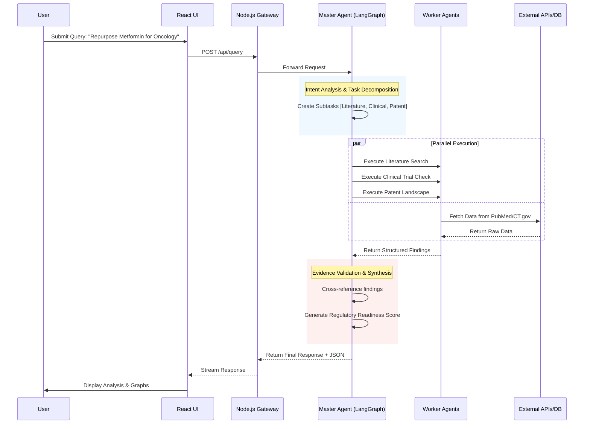

# Architecture & Flow Diagrams for RepurposeIQ

## 1. High-Level Architecture Diagram (Mandatory)

```mermaid
graph TD
    subgraph Client ["Client Layer (React)"]
        UI[Interactive UI]
        Dashboard[Data Visualization]
        ReportView[PDF Viewer]
    end

    subgraph Gateway ["API Gateway (Node.js)"]
        Auth[Auth Service (JWT)]
        RateLimit[Rate Limiter]
        Router[Router]
    end

    subgraph Brain ["Intelligence Layer (Python/LangGraph)"]
        Master[Master Agent Orchestrator]
        subgraph Agents ["Worker Agents"]
            Clinical[Clinical Agent]
            Patent[Patent Agent]
            Market[Market Agent]
            Literature[Literature Agent]
            Internal[Internal Knowledge Agent]
        end
        Verify[Verification/Critic Node]
    end

    subgraph Data ["Data & Storage"]
        VectorDB[(ChromaDB - RAG)]
        Redis[(Redis - Cache)]
        SQL[(PostgreSQL - User Data)]
    end

    subgraph External ["External Sources"]
        PubMed[PubMed API]
        CTGov[ClinicalTrials.gov]
        USPTO[USPTO Patent API]
        Web[Web Search Proxy]
    end

    UI -->|HTTPs/WebSocket| Router
    Router --> Auth
    Auth --> Master
    
    Master -->|Orchestrates| Agents
    Agents -->|Tools| External
    Agents -->|RAG| VectorDB
    Master -->|Read/Write| Redis
    Router -->|User Data| SQL
```

## 2. Process Flow Chart (Mandatory)



## 3. Wireframe Suggestions

For the **Wireframes** slide, please take screenshots of the following pages from the running application:

1.  **Dashboard Home**: Showing the "Market Opportunity" cards and "Recent Queries".
2.  **Chat Interface**: Showing a query with the "Thinking..." or "Agents Active" indicator to demonstrate the real-time agentic nature.
3.  **Report View**: Showing a generated report with charts and the "Download PDF" button.

## 4. Innovations & USPs (For Slide 6/8)

-   **USP 1: Deep Semantic Verification**: Unlike standard Chatbots that just "predict next token", RepurposeIQ uses a "Critic Loop" to verify if the cited clinical trial actually supports the claim.
-   **USP 2: Dynamic Knowledge Graph**: We build a temporary graph of relationships (Drug -> Mechanism -> Disease) during the session to find non-obvious connections.
-   **USP 3: Regulatory-First Architecture**: Every suggestion is pre-screened against a "Regulatory Readiness" model.
